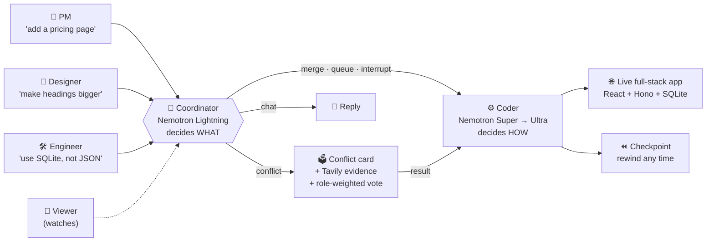

<div align="center">

```
███╗   ███╗██╗   ██╗██╗  ██╗
████╗ ████║██║   ██║╚██╗██╔╝
██╔████╔██║██║   ██║ ╚███╔╝
██║╚██╔╝██║██║   ██║ ██╔██╗
██║ ╚═╝ ██║╚██████╔╝██╔╝ ██╗
╚═╝     ╚═╝ ╚═════╝ ╚═╝  ╚═╝
   8 inputs ─▶ [ MUX ] ─▶ 1 agent
```

### Eight people steering. One agent building.
**Google Docs for AI app-building.**

[](source-of-truth/prd.md)
[](source-of-truth/prd.md)
[](docs/02-architecture.md)


[**📚 Docs**](docs/README.md) ·
[**🚀 Quick start**](docs/03-getting-started.md) ·
[**🏗️ Architecture**](docs/02-architecture.md) ·
[**🗺️ Roadmap**](docs/07-status-and-roadmap.md) ·
[**🎮 Try the demo**](#-try-it-in-60-seconds)

</div>

---

## 🤯 The problem

AI coding agents are **single-player**. On a real team the PM, the designer and the engineer all have opinions, but only one person holds the keyboard. Everyone else shouts over a shoulder, pastes feedback into Slack, or waits for a screen share. Conflicting instructions get settled by **whoever typed last**, with no record of why.

## 💡 The fix

**MUX** is one shared agent session that a whole team joins through a link. Everyone watches the agent think, code and build live, and **everyone can steer it at the same time**.



## ✨ Feature tour

<table>
<tr>
<td width="50%" valign="top">

### 🧠 Every message gets a label
The coordinator reads each message in order and tags it:

| Label | What happens |
|---|---|
| 🟢 **merge** | Folded into the current task at the next turn |
| 🔵 **queue** | Added to the plan as new work |
| 🟠 **interrupt** | Coder stops and re-plans |
| 🔴 **conflict** | Opens a vote with research |
| ⚪ **chat** | Coordinator answers, coder undisturbed |

</td>
<td width="50%" valign="top">

### 🗳️ Conflicts with receipts
Two people want opposite things? MUX opens a **conflict card**, runs **1–3 Tavily searches**, writes a **cited summary**, and the room votes.

- 🎨 Design owns **UI** → their vote counts **2×**
- 🛠️ Eng owns **architecture** → **2×**
- 🧭 PM owns **scope** → **2×**
- 👑 The owner can override at any time
- ⏭️ The coder skips the disputed task and keeps going

</td>
</tr>
<tr>
<td valign="top">

### ⏪ Rewind anything
A checkpoint is saved after **every finished task**: file manifest, sandbox snapshot, plan and log. Rewinding is instant because the backend owns the files.

</td>
<td valign="top">

### ✍️ Humans can code too
Edit files by hand next to the agent. Soft locks show who's editing, version checks mean **nobody's work is silently overwritten**, and the coder is told about your edit at its next turn.

</td>
</tr>
<tr>
<td valign="top">

### 🪙 Token-frugal by design
Target: **≥ 40% fewer tokens per finished task** than a naive agent loop: fresh context per task, compacted tool output, line-range reads, search-and-replace edits, cheapest model per job.

</td>
<td valign="top">

### 🌐 Live preview + GitHub export
Apps run **in your browser** through WebContainers, builds run in **Nebius Token Factory Sandboxes**, and the owner exports clean code straight to GitHub.

</td>
</tr>
</table>

## 🎮 Try it in 60 seconds

No accounts, no backend, no API keys: demo mode runs the whole UI from the browser.

```bash
git clone https://github.com/DhruvChaudhari130905/Nvidia_Hackathon.git
cd Nvidia_Hackathon/mux/web
npm install
NEXT_PUBLIC_DEMO_MODE=true npm run dev
# → open http://localhost:3000/room/demo-yoga
```

> [!TIP]
> Or run `npm run dev` and click **"Try the demo"** on the login page.

Full setup (backend, env vars, tests) is in **[Getting started](docs/03-getting-started.md)**.

## 🧱 Stack at a glance

| Layer | Tech |
|---|---|
| 🖥️ Frontend | Next.js 15 (App Router), React 18, TypeScript, Tailwind, Monaco, xterm.js, WebContainers |
| 🔌 API | FastAPI + uvicorn behind Caddy (TLS + WebSockets) |
| 🎭 Room runtime | One asyncio **room actor** per room, a single ordered writer |
| 🤖 Models | NVIDIA **Nemotron 3** on Nebius Token Factory (Lightning · Super · Ultra) |
| 🔎 Research | Tavily |
| 🗄️ Storage & auth | Supabase Postgres + Supabase Auth |
| 🏗️ Builds | Nebius Token Factory Sandboxes |

## 📂 Repo map

```
Nvidia_Hackathon/
├── 📚 docs/               ← start here: the full documentation hub
├── 🧭 source-of-truth/    PRD + architecture (the design contract)
├── 📓 session-log/        decision logs from every design session
├── 🎨 demos/              static HTML mockups of the room and workflow
└── 🧩 mux/
    ├── web/               Next.js frontend (works today in demo mode)
    ├── server/            FastAPI backend (coordinator + memory done)
    ├── evals/             coordinator, build and token evals
    ├── infra/             Caddyfile, VM setup, sandbox image
    ├── templates/         full-stack starter the agent builds on
    └── packages/schema/   shared JSON Schema → TypeScript types
```

## 🚦 Where things stand

| Area | Status |
|---|---|
| Frontend (`mux/web`) | 🟢 Built, works end to end in **demo mode** |
| Coordinator, Tavily research, memory | 🟢 Done offline |
| API, room actor, DB layer, coder agent, sandbox | 🟡 Implemented and speaking the web app's contract; coordinator and coder run in every room once Token Factory keys are set; 214 tests pass, pyright clean |
| Infra (Caddy, VM setup, sandbox image) | 🟡 Written, not deployed |
| Evals, starter template | 🔴 Placeholders only |

Details: **[Status & roadmap](docs/07-status-and-roadmap.md)**

## 🧑‍🤝‍🧑 Team

Four students, four lanes: **P-API**, **P-DB**, **P-Agent-A** (coordinator & memory), **P-Agent-B** (coder agent). See [Contributing](docs/08-contributing.md).

---

<div align="center">

**Why "MUX"?** An 8:1 multiplexer takes eight inputs and routes them into one output.<br/>
Up to eight people steering → one agent building.

<sub>Built for the Nebius × NVIDIA Global AI Hackathon 2026 · submission due Oct 30, 2026</sub>

</div>
