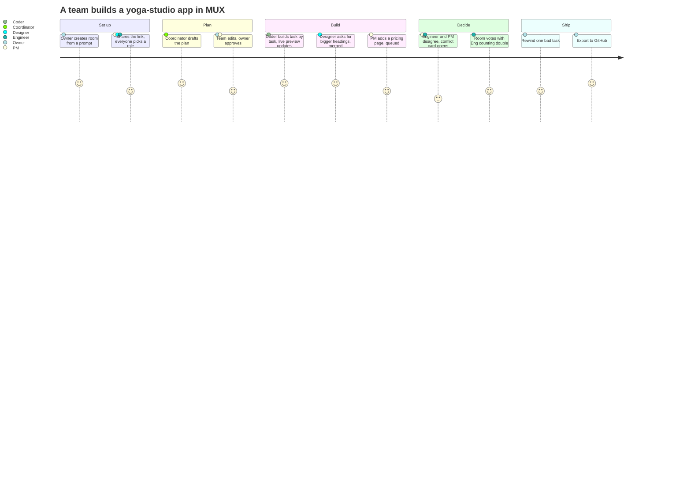

# 🤔 01 · Overview

> **Eight people steering, one agent building.** MUX is a shared AI coding session a cross-functional team joins by link, like a Google Doc.

[📚 Docs home](README.md) · **Next →** [02 · Architecture](02-architecture.md)

---

## 😩 The problem

AI coding agents (Cursor, Claude Code, Lovable, v0) are single-player. On a product team:

- 🔒 **Non-engineers are locked out** of the build loop, and their intent gets lost in translation.
- 🚧 **The driver becomes a bottleneck** and a lossy relay for everyone else's ideas.
- 🎲 **Conflicts are settled by whoever types last** ("add login" vs. "keep it anonymous"), with no record of why.

## 💡 The idea

One agent per room, with **two model roles** that never step on each other:

| | 🧠 Coordinator | ⚙️ Coder |
|---|---|---|
| **Decides** | *What* gets built | *How* to build it |
| **Model** | Nemotron 3.5 Lightning (plans on Super) | Nemotron 3 Super, escalates to Ultra |
| **Sees** | Plan, pending messages, cards, roles, logs | The current task, files, build output |
| **Never** | Reads file contents | Gets instructions mid-turn |
| **Writes code?** | ❌ | ✅ the only AI that does |

## 👥 Who it's for

Cross-functional **student and early-stage product teams** (2–8 people) prototyping together: hackathons, capstones, startup ideation.

| Role | What they get |
|---|---|
| 🧭 **PM** | Steer scope without waiting on an engineer; a trail of why each decision was made |
| 🎨 **Designer** | Shape the UI directly in the running prototype; own visual decisions |
| 🛠️ **Engineer** | Keep architecture sane, veto bad technical calls, edit code, export clean code |
| 👀 **Viewer** | Watch live (mentor, stakeholder, judge) without derailing anything |

## 🎬 A session, start to finish

## 🏆 Why it should win

| Judging criterion | How MUX scores |
|---|---|
| **Technological implementation** | Two Nemotron roles with distinct jobs; Token Factory Sandboxes with a snapshot per checkpoint; full-stack apps live in the browser; measured token savings; Tavily as a first-class tool |
| **Design** | A complete product: accounts, sharing, roles, presence, plan approval, preview, editable code, cards, timeline with rewind, export |
| **Potential impact** | A real audience with a real, observed pain, backed by user tests with 3+ student teams |
| **Quality of idea** | Multiplayer *steering* of one agent (not just shared chat) plus evidence-backed, role-weighted conflict resolution |

## 📏 Targets we hold ourselves to

| Metric | Target |
|---|---|
| 🎯 Coordinator label accuracy | ≥ 85% on 50 scenarios |
| 🏗️ Build + test success | ≥ 80% on 20 prompts |
| 🪙 Tokens per finished task | ≥ 40% fewer than a naive loop |
| 🧾 Lightning valid JSON | ≥ 95% on 50 calls |

---

**Next →** [02 · Architecture](02-architecture.md)
