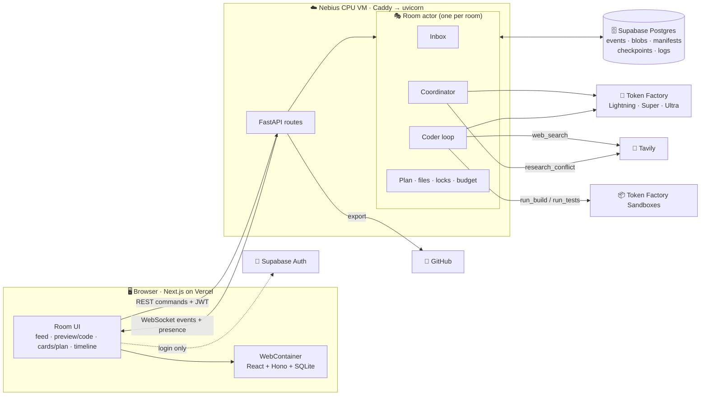
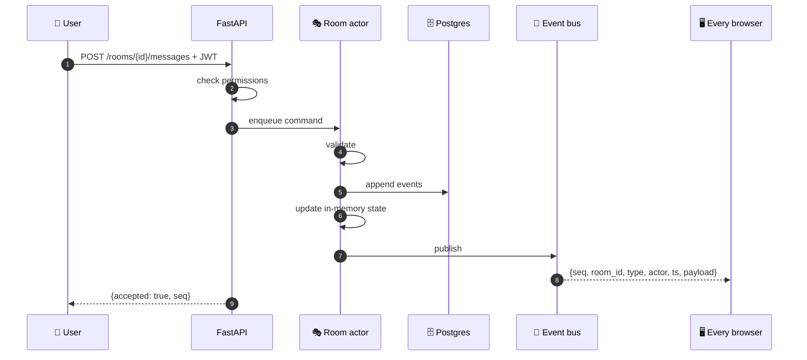
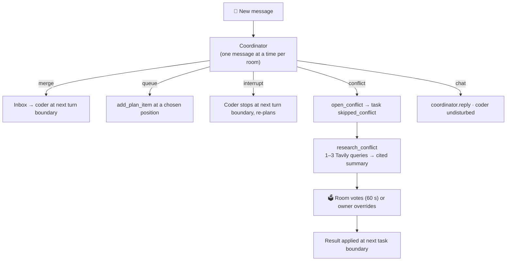
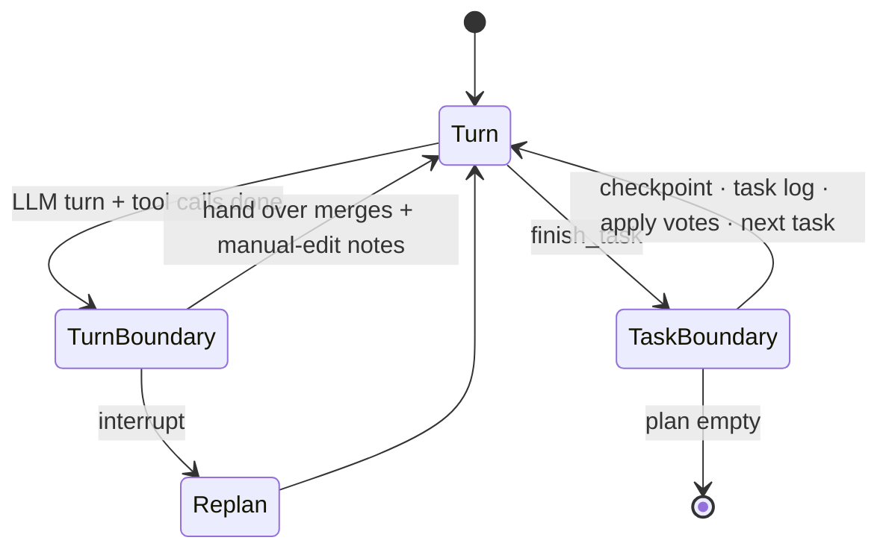
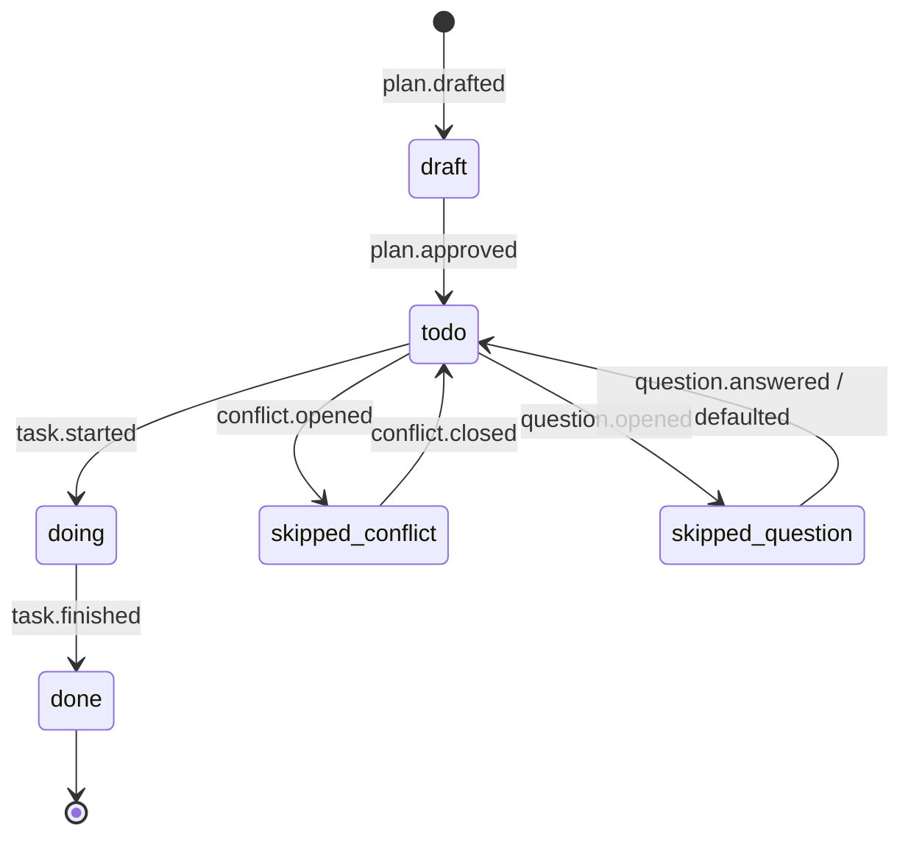

# 🏗️ 02 · Architecture

> The short tour. The full contract is [`source-of-truth/architecture.md`](../source-of-truth/architecture.md).

**← Prev** [01 · Overview](01-overview.md) · [📚 Docs home](README.md) · **Next →** [03 · Getting started](03-getting-started.md)

---

## 📜 Five rules everything follows

| # | Rule | Why it matters |
|---|---|---|
| 1 | **One writer per room** | Many people, one ordered stream of changes. No races. |
| 2 | **Events are the truth** | UI, timeline, rewind and crash recovery are all rebuilt from the event log. |
| 3 | **The backend owns the files** | Sandboxes and browsers borrow copies, so rewind is instant. |
| 4 | **AI never holds secrets or shells** | Fixed toolset, no shell, no model ever sees a GitHub token. |
| 5 | **Spend tokens only where they buy quality** | Fresh context per task, trimmed output, cheapest model per job. |

## 🌍 The whole system



## 🎭 The room actor

One asyncio task per active room. Every REST command **and every agent action** goes into its mailbox, and it handles them one at a time:



The coordinator and the coder are **child tasks** of the actor. They never touch state directly; they send actions to the mailbox like any user. After a restart, the registry replays events from the latest checkpoint to rebuild the room.

## 🧠 How a message flows



The coordinator returns **one JSON action per message**, not tool calls, which is faster and more reliable on a small model:

```json
{
  "label": "merge | queue | interrupt | conflict | chat",
  "rationale": "one sentence",
  "domain": "ui | architecture | scope | null",
  "add_plan_item": { "title": "...", "after_task_id": "t4" },
  "open_conflict": { "with_message_ids": ["m12"], "summary": "...", "options": ["...", "..."], "research_queries": ["..."] },
  "reply": "text for chat messages"
}
```

## 🗳️ Conflict cards with receipts

| Rule | Value |
|---|---|
| Who votes | Editors and the owner |
| Weight | 1 per voter, **2** when your domain role owns the conflict's domain |
| Domains | 🎨 Design → UI · 🛠️ Eng → architecture/data · 🧭 PM → scope/features |
| Closes when | Everyone voted, **or** 60 s pass, **or** the owner overrides |
| Ties | Owner's choice, then the option the domain-role voter backed |
| Meanwhile | The coder skips the disputed task and keeps working |

## ⚙️ The coder's two pause points



**Fixed toolset, no shell:** `read_file` · `write_file` · `edit_file` · `list_files` · `delete_file` · `run_build` · `run_tests` · `web_search` · `ask_room` · `update_plan` · `finish_task`. Two failed builds in a row escalate the task from Super to Ultra.

## 📋 Plan item lifecycle



## ⏪ Checkpoints & rewind

At every task boundary the actor saves a **checkpoint**: file manifest · sandbox snapshot UUID · plan · task log · parent.

Rewinding moves the head to that checkpoint (no sandbox call, so it's instant), greys out later events instead of deleting them, re-classifies pending messages against the restored plan, and sends `room.rewound` so browsers reload.

## 🪙 Token efficiency (target ≥ 40% savings)

| Technique | Where |
|---|---|
| Fresh context per task + a one-page rolling log | `context.py`, `memory/` |
| Used tool results shrink to one-line stubs | `compaction.py` |
| Line-range reads, compact repo map | `tools/files.py`, `files/repo_map.py` |
| Search-and-replace edits, not whole files | `tools/files.py` |
| Build output trimmed to 5 deduplicated errors | `sandbox/errors.py` |
| Short, cached Tavily results | `integrations/tavily.py` |
| Cheapest model per job | `agents/llm.py` |
| Coordinator never reads files | `agents/coordinator/prompts.py` |

## 🔐 Permissions

| Action | 👑 Owner | ✏️ Editor | 👀 Viewer |
|---|:-:|:-:|:-:|
| Watch the room | ✅ | ✅ | ✅ |
| Steer, vote, answer questions | ✅ | ✅ | ❌ |
| Edit files, rewind | ✅ | ✅ | ❌ |
| Approve plan, override votes | ✅ | ❌ | ❌ |
| Sharing, budget, export, delete | ✅ | ❌ | ❌ |

## ☁️ Deployment

| Piece | Where |
|---|---|
| Frontend | Vercel |
| Backend | One Nebius CPU VM: uvicorn (systemd) behind Caddy |
| Database + auth | Supabase |
| Models + sandboxes | Nebius Token Factory |
| Search | Tavily |

---

**← Prev** [01 · Overview](01-overview.md) · **Next →** [03 · Getting started](03-getting-started.md)
