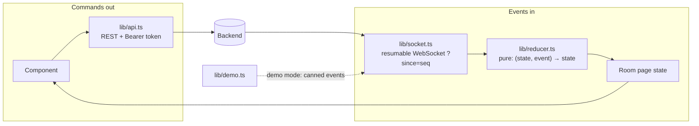
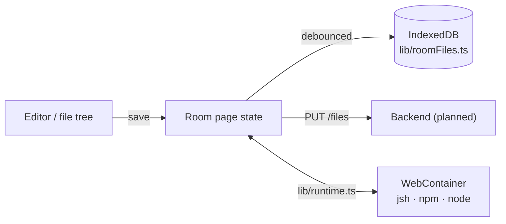

# 🖥️ 04 · Frontend (`mux/web`)

**← Prev** [03 · Getting started](03-getting-started.md) · [📚 Docs home](README.md) · **Next →** [05 · Backend](05-backend.md)

---

## 🧱 Stack

Next.js 15 (App Router) · React 18 · TypeScript · Tailwind · Monaco editor · xterm.js · WebContainers · Supabase Auth · date-fns · lucide-react

## 🗺️ Pages

| Route | What's there |
|---|---|
| `/` | Landing: feature slides, live room preview, how it works, testimonials |
| `/login` | Google / GitHub sign-in, or **Try the demo** |
| `/auth/callback` | OAuth code exchange with error handling |
| `/dashboard` | Your rooms: search (`/`), filters, create, import a folder or `.zip` |
| `/room/[roomId]` | ⭐ The workspace (below) |
| `/profile` | Default domain role, Connect GitHub |
| `/pricing`, `/docs`, `/sandbox` | Marketing and in-app docs |

## 🏠 The room layout

```
┌───────────────────────────────────────────────────────────────────────────┐
│ ← MUX   Room title           👤👤👤   ▓▓▓░░ 1.2M/2M tokens   🔔 Share Export │  TopBar
├──────────────────┬───────────────────────────────────┬────────────────────┤
│ FEED             │  [ Preview | Code ]                │ DECISIONS & PLAN   │
│ 🗳️ Vote open…    │ ┌────────┬──────────────────────┐  │ ┌────────────────┐ │
│ 🟣 Priya  merge  │ │ files  │  Monaco editor       │  │ │ Conflict · t3  │ │
│ 🟢 Marco  queue  │ │ tree   │                      │  │ │ ▓▓▓▓░ Option A │ │
│ 🔵 MUX    chat   │ │        ├──────────────────────┤  │ │ ▓░░░░ Option B │ │
│                  │ │        │ terminal · output    │  │ └────────────────┘ │
│ [ message…  ] ⏎  │ └────────┴──────────────────────┘  │ ✓ t1  ● t2  ⏸ t3   │
├──────────────────┴───────────────────────────────────┴────────────────────┤
│ ●───────●───────●───────◉ live         timeline · click to rewind          │
└───────────────────────────────────────────────────────────────────────────┘
```

| Area | Components |
|---|---|
| Top bar | `components/room/` — `TopBar`, `Presence`, `BudgetMeter`, `ShareDialog`, `ExportDialog`, `Notifications` |
| Feed | `components/feed/` — `Feed`, `FeedItem`, `LabelChip`, `ConflictBanner`, `Composer` |
| Center | `components/center/` — `CenterTabs`, `Preview`, `CodeEditor`, `FileTree`, `ShellTerminal`, `BottomPanel`, `QuickOpen` |
| Side | `components/side/` — `SidePanel`, `ConflictCard`, `QuestionCard`, `PlanList`, `PlanApproval` |
| Timeline | `components/timeline/Timeline.tsx` |

## 🔄 Data flow



- **One reducer.** `lib/reducer.ts` is pure and never mutates, so replay and rewind are free.
- **Resumable socket.** Reconnects pass the last `seq`, duplicates are skipped, and after 5 failed attempts the room shows an offline banner with **Reconnect**.
- **Auth.** REST calls carry the Supabase access token; the socket sends it as its first message.

## 📁 Files & the in-browser shell



Edits are **local first**: they land in state and IndexedDB straight away, then sync to the server. Files that shell commands create or change in the WebContainer flow back into the room.

## 📚 `lib/` cheat sheet

| File | Job |
|---|---|
| `api.ts` | REST client; answers locally in demo mode |
| `socket.ts` | WebSocket client, status, reconnect |
| `reducer.ts` | Events → room state |
| `supabase.ts` | Auth client, `getAccessToken()`, safe redirects |
| `demo.ts` | Sample rooms, users and event history |
| `runtime.ts` / `webcontainer.ts` | Boot the WebContainer, two-way file sync |
| `roomFiles.ts` | Per-room files in IndexedDB |
| `projectImport.ts` | Import a folder, drop or `.zip` (with size caps) |
| `codeRunner.ts` | Run a single file (JS/TS locally, other languages on Wandbox after consent) |
| `countdown.ts` | Timezone-safe `m:ss` timers |
| `users.ts` | Resolve a user id to a name, initials and colour |
| `notifications.ts` | Toasts, bell and desktop notifications |

## 🎨 Theme

GitHub-Dark tokens in `src/styles/theme.css` and `src/app/globals.css`: `--bg`, `--panel`, `--ink`, `--muted`, `--line`, `--coord`, `--conflict`, `--ask`. Room components use these CSS variables; marketing pages use the Tailwind theme in `tailwind.config.js`.

## 🛠️ Scripts

| Command | Does |
|---|---|
| `npm run dev` | Dev server on :3000 |
| `npm run build` / `start` | Production build / serve |
| `npm run lint` | ESLint (flat config, `next/core-web-vitals` + `next/typescript`) |
| `npm run gen:types` | JSON Schema from the backend → `src/types/generated/` |

---

**← Prev** [03 · Getting started](03-getting-started.md) · **Next →** [05 · Backend](05-backend.md)
