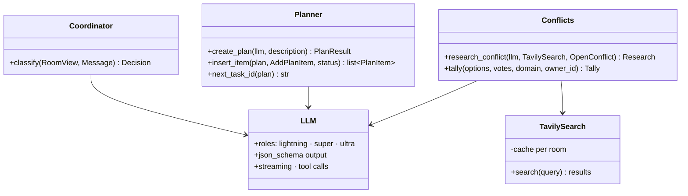

# 🐍 05 · Backend (`mux/server`)

**← Prev** [04 · Frontend](04-frontend.md) · [📚 Docs home](README.md) · **Next →** [06 · Event catalog](06-event-catalog.md)

---

## 🧱 Stack

FastAPI · uvicorn · Pydantic v2 · OpenAI Python client (pointed at Nebius Token Factory) · Tavily · SQLAlchemy (async) + asyncpg · Alembic · PyJWT · pytest

## 🗂️ Module map

Legend: 🟢 done · 🔴 stub (one-line docstring only)

```
mux/server/mux/
├── main.py                 🔴 app factory, routers
├── config.py               🟢 settings (Agent-A fields so far)
├── api/                    🔴 rooms · commands · files · export · ws
├── auth/                   🔴 Supabase JWT, owner/editor/viewer rules
├── rooms/                  🔴 actor · registry · inbox · plan · locks · budget · presence · sitting
├── events/                 🔴 models (shared contract) · bus · log
├── agents/
│   ├── llm.py              🟢 Token Factory client: roles, JSON schema, streaming, tool calls
│   ├── coordinator/        🟢 agent · schema · prompts · planner · conflicts
│   └── coder/              🔴 loop · context · compaction · escalation · tools/
├── integrations/
│   ├── tavily.py           🟢 per-room cached search
│   └── github.py           🔴 export
├── memory/                 🟢 pins · task_log · day_log
├── files/                  🔴 store · manifest · repo_map
├── checkpoints/            🔴 checkpoint · rewind
├── sandbox/                🔴 client · runner · errors
├── db/                     🔴 session · tables
└── replay/
    ├── fake_llm.py         🟢 scripted LLM for tests
    └── fake_sandbox.py     🔴
```

## 🧠 The coordinator (done)



- **One action per message**, validated before the actor applies it.
- **Model errors don't crash the room:** a bad or missing JSON answer returns `fallback=True` (the message is queued; plans fall back to one task). API errors propagate.
- **`tally`** counts each person's latest vote, weights the domain role 2×, then breaks ties by the owner's vote, then by the domain-role voters.

## 🧾 Memory (done)

| Piece | What it keeps | Size |
|---|---|---|
| 📌 **Pins** | Vote results and owner overrides, copied forward forever | small |
| 📝 **Task log** | What the app is, what changed, open threads, conventions | ~600 tokens |
| 📅 **Day log** | Compacted state at the end of a sitting; the next sitting reads only this | ~1 page |

Every log is stored with its checkpoint, so rewinding also rewinds what the agent remembers.

## 🤝 Interfaces other lanes call

| Lane | Calls |
|---|---|
| **P-API** (room actor) | `Coordinator(llm).classify(...)`, `create_plan(...)`, `insert_item(...)`, `research_conflict(...)`, `tally(...)` |
| **P-Agent-B** (coder) | `TavilySearch` for `web_search`; `FakeLLM` in coder-loop tests |

## 🧪 Testing

```bash
cd mux/server
pytest -q                      # coordinator, conflicts, memory: 36 tests
pyright mux tests scripts      # 0 errors
python scripts/spike_lightning_json.py   # needs real keys: Lightning JSON reliability
```

Tests run with `replay/fake_llm.py`, so **no API keys are needed**.

## 📏 Evals (planned, `mux/evals/`)

| Eval | Target |
|---|---|
| `coordinator/` | ≥ 85% label accuracy on 50 scenarios |
| `builds/` | ≥ 80% build + test success on 20 prompts |
| `tokens/` | ≥ 40% fewer tokens than `naive_agent.py` |

---

**← Prev** [04 · Frontend](04-frontend.md) · **Next →** [06 · Event catalog](06-event-catalog.md)
