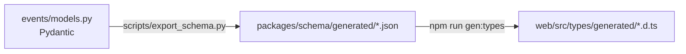

# 📡 06 · Event catalog

> Every change in a room is an event. The UI, the timeline, rewind and crash recovery are all rebuilt from them.

**← Prev** [05 · Backend](05-backend.md) · [📚 Docs home](README.md) · **Next →** [07 · Status & roadmap](07-status-and-roadmap.md)

---

## ✉️ The envelope

```json
{
  "seq": 128,
  "room_id": "r_42",
  "type": "conflict.vote",
  "actor": "user_7",
  "ts": "2026-10-12T14:03:22Z",
  "payload": { "conflict_id": "c1", "user_id": "user_7", "option": "SQLite", "weight": 2 }
}
```

- `seq` increases by one per room. A reconnecting client sends `?since=<last seq>` and misses nothing.
- Presence messages and `agent.text.delta` use the same socket but are **never stored**.

## 🔌 Socket

```
GET /rooms/{id}/ws?since={seq}
first client message: {"type": "auth", "payload": {"token": "<supabase jwt>"}}
```

The token may also come as `?token=` or an `Authorization` header. The server answers with a JSON array of every envelope after `since`, then one envelope per message. Unstored messages (`presence.tab`) carry the room's current `seq`, so they never move a client's resume point. Server code: `mux/server/mux/api/ws.py`, envelope mapping in `mux/server/mux/events/wire.py`.

## 📖 All event types

| Group | Event | Stored | Payload (short) |
|---|---|:-:|---|
| 🏠 Room | `room.created` | ✅ | room settings |
| | `member.joined` | ✅ | membership |
| | `member.role_changed` | ✅ | `user_id`, `permission` |
| | `sharing.changed` | ✅ | `link_access`, `link_permission` |
| 💬 Messages | `message.posted` | ✅ | `id`, `user_id`, `text` |
| | `message.labeled` | ✅ | `message_id`, `label`, `rationale`, `domain` |
| 📋 Plan | `plan.drafted` | ✅ | `items[]` |
| | `plan.edited` | ✅ | `items[]` |
| | `plan.approved` | ✅ | — |
| | `plan.item_added` | ✅ | plan item |
| | `plan.item_updated` | ✅ | `id`, `changes` |
| 🧠 Coordinator | `coordinator.reply` | ✅ | `text` |
| | `conflict.opened` | ✅ | conflict (options, domain, expires_at) |
| | `conflict.evidence` | ✅ | `conflict_id`, `evidence[]` with citations |
| | `conflict.vote` | ✅ | `conflict_id`, `user_id`, `option`, `weight` |
| | `conflict.closed` | ✅ | `conflict_id`, `result`, `resolved_by` |
| | `question.opened` | ✅ | question (options, default, expires_at) |
| | `question.answered` | ✅ | `question_id`, `answer` |
| | `question.defaulted` | ✅ | `question_id` |
| ⚙️ Coder | `task.started` | ✅ | `task_id` |
| | `agent.text` | ✅ | full text of a turn |
| | `agent.text.delta` | ❌ | streaming chunk |
| | `tool.called` / `tool.result` | ✅ | tool name, args / summary only |
| | `build.result` / `test.result` | ✅ | passed, ≤ 5 errors, snapshot id |
| | `task.escalated` | ✅ | Super → Ultra |
| | `task.finished` | ✅ | `task_id` |
| | `turn.interrupted` | ✅ | — |
| 📁 Files | `file.changed` | ✅ | `path`, `hash`, `version`, diff summary |
| | `file.locked` / `file.unlocked` | ✅ | `path`, `user_id` |
| ⏪ Checkpoints | `checkpoint.created` | ✅ | manifest, snapshot, plan, log, parent |
| | `room.rewound` | ✅ | `checkpoint_id` |
| 🧾 Memory | `log.task_written` / `log.day_written` | ✅ | log id |
| 💰 Budget | `budget.updated` | ✅ | tokens/runs used and caps |
| | `room.paused` / `room.resumed` | ✅ | — |
| 🐙 Export | `export.started` / `export.finished` | ✅ | repo link |
| 👥 Presence | `presence.join` / `leave` / `typing` / `tab` | ❌ | `user_id`, state |

## 🔁 Contract sync



> [!IMPORTANT]
> `events/models.py` is the single source of truth. Until it's frozen, `web/src/types/index.ts` is hand-written and tolerates both the architecture's and the demo's shapes (for example `actor` and `actor_id`).

---

**← Prev** [05 · Backend](05-backend.md) · **Next →** [07 · Status & roadmap](07-status-and-roadmap.md)
