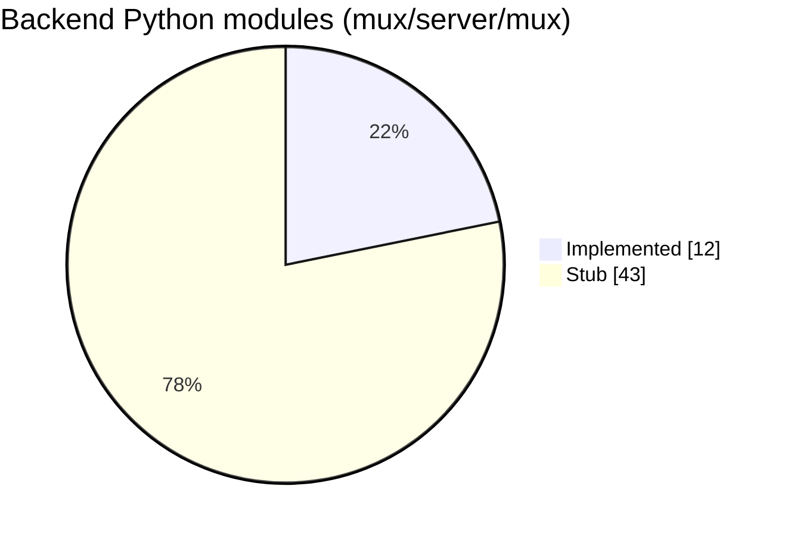

# 🚦 07 · Status & roadmap

> Snapshot from the Oct 2 review. The file-by-file truth lives in [`PROJECT_STATUS.md`](../PROJECT_STATUS.md).

**← Prev** [06 · Event catalog](06-event-catalog.md) · [📚 Docs home](README.md) · **Next →** [08 · Contributing](08-contributing.md)

---

## 📊 Where we are

| Area | Status | Notes |
|---|---|---|
| 🖥️ Frontend | 🟢 Built | Every page and the room workspace; works end to end in demo mode |
| 🧠 Coordinator + Tavily + memory | 🟢 Done offline | 36 tests, pyright clean; no live Token Factory call yet |
| 🔌 API, auth, room actor, events | 🔴 Not started | P-API |
| 🗄️ DB, files, checkpoints, sandbox | 🔴 Not started | P-DB |
| ⚙️ Coder agent + tools | 🔴 Not started | P-Agent-B |
| 📏 Evals, infra, starter template | 🔴 Not started | placeholders only |

Counted on Oct 2: a stub is a file with only its one-line docstring (`__init__.py` files excluded).

## 🗓️ Schedule

## ✅ Hard submission checklist

- [ ] Runs on Nebius Token Factory (models + Sandboxes) and Nebius AI Cloud
- [ ] Uses an NVIDIA open model (Nemotron 3 family)
- [ ] Public repo with an OSS license (MIT) and a README with setup steps
- [ ] Working live demo URL
- [ ] Demo video under 3 minutes, on YouTube, with audio
- [ ] Project description and tool-feedback write-up
- [ ] All work created Aug 26 – Oct 30, 2026

## 🧪 Week-1 spikes

| Spike | Pass condition | Fallback |
|---|---|---|
| WebContainers run Vite + Hono + SQLite | Boots and hot-reloads < 15 s | Sandbox port or per-room container |
| Nebius sandbox exposes a port | Hono reachable | Keep WebContainers |
| Sandbox build time | Type-check + build < 30 s | Smaller template, longer timeout |
| Lightning JSON reliability | ≥ 95% valid on 50 calls | Super as coordinator |
| Super tool calling | Correct on 20 scripted tasks | JSON-in-text tool calls |
| Prompt caching + reasoning switch | Documented or observed | Skip both techniques |
| WebSockets through Caddy | Stable 30 min with reconnect | Server-sent events |

## 🐞 Known issues

Frontend bugs from the review were fixed on the `fix/frontend-bugs` branch. Open backend items (B27–B29 and the backend Low items) are tracked in [`BUGS_AND_ERRORS.md`](../BUGS_AND_ERRORS.md).

## 🌱 Stretch

Forking a room · research mode · real-time co-editing of one file (CRDT).

---

**← Prev** [06 · Event catalog](06-event-catalog.md) · **Next →** [08 · Contributing](08-contributing.md)
