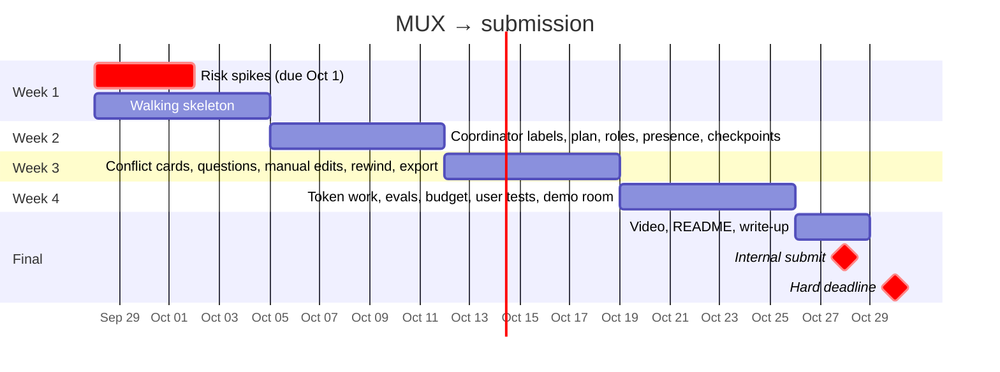

# 🚦 07 · Status & roadmap

> Snapshot updated Oct 4, after the room backend merge (PR #2).

**← Prev** [06 · Event catalog](06-event-catalog.md) · [📚 Docs home](README.md) · **Next →** [08 · Contributing](08-contributing.md)

---

## 📊 Where we are

| Area | Status | Notes |
|---|---|---|
| 🖥️ Frontend | 🟢 Built | Every page and the room workspace; works end to end in demo mode |
| 🧠 Coordinator + Tavily + memory | 🟢 Done offline | No live Token Factory call yet |
| 🔌 API, auth, room actor, events | 🟡 Implemented | In-memory event log; REST under `/api`, WebSocket at `/ws/rooms/{id}` |
| 🗄️ DB, files, checkpoints, sandbox | 🟡 Implemented | Postgres layer; DB tests need `docker compose up` |
| ⚙️ Coder agent + tools | 🟡 Implemented | Runs against the fake LLM and fake sandbox in tests |
| 📏 Infra | 🟡 Written | Caddyfile, VM setup, sandbox image; not deployed |
| 📏 Evals, starter template | 🔴 Placeholders only | `evals/*/run.py` and `templates/fullstack-starter/` |

All 57 backend modules are implemented (none are one-line stubs). 203 tests pass with the Postgres test database up (177 without it), and pyright reports 0 errors.

### Open integration work

- **Two data layers.** The room actor uses in-memory stores (`InMemoryEventLog`, `FileManifest`, `FileStore`, `mux/dbsession.py`). Checkpoints, rewind, room files and the coder tools use the Postgres layer (`events.log.append/read_since`, `files.manifest.LiveFiles`, `files.store.put/get`, `mux/db/session.py`). Both live in the same modules today and both are tested; they still need to be joined.
- **Web ↔ API: done (Oct 4).** The server serves the architecture's REST paths at the root (`/rooms/...`, `/github/connect`) and the socket at `/rooms/{id}/ws` (first-message auth, initial dump, resume by `seq`). Every actor event goes out as the catalog envelope (`mux/events/wire.py`); a test checks each envelope type exists in `web/src/types/index.ts`. Operator APIs stay under `/api/commands`, `/api/files`, `/api/export`.
- **Contract gaps left.** Conflicts and questions opened by the actor carry no options yet, and vote weight is always 1 (role weighting lives in the coordinator's conflicts module). Raising the budget only emits `budget.updated` when it un-pauses the room. Export pushes to an existing repo (`private` is ignored). Email invites return 400. File deletes and plan-item removals have no catalog event, so other viewers see them after a reload.
- **Agents not driven by the room.** The coordinator and coder exist and are tested, but nothing feeds them room messages yet.

## 🗓️ Schedule

## ✅ Hard submission checklist

- [ ] Runs on Nebius Token Factory (models + Sandboxes) and Nebius AI Cloud
- [ ] Uses an NVIDIA open model (Nemotron 3 family)
- [ ] Public repo with an OSS license (MIT) and a README with setup steps
- [ ] Working live demo URL
- [ ] Demo video under 3 minutes, on YouTube, with audio
- [ ] Project description and tool-feedback write-up
- [ ] All work created Aug 26 – Oct 30, 2026

## 🧪 Week-1 spikes

| Spike | Pass condition | Fallback |
|---|---|---|
| WebContainers run Vite + Hono + SQLite | Boots and hot-reloads < 15 s | Sandbox port or per-room container |
| Nebius sandbox exposes a port | Hono reachable | Keep WebContainers |
| Sandbox build time | Type-check + build < 30 s | Smaller template, longer timeout |
| Lightning JSON reliability | ≥ 95% valid on 50 calls | Super as coordinator |
| Super tool calling | Correct on 20 scripted tasks | JSON-in-text tool calls |
| Prompt caching + reasoning switch | Documented or observed | Skip both techniques |
| WebSockets through Caddy | Stable 30 min with reconnect | Server-sent events |

## 🐞 Known issues

Frontend bugs from the review were fixed on the `fix/frontend-bugs` branch. The open backend items are listed under **Open integration work** above.

## 🌱 Stretch

Forking a room · research mode · real-time co-editing of one file (CRDT).

---

**← Prev** [06 · Event catalog](06-event-catalog.md) · **Next →** [08 · Contributing](08-contributing.md)
