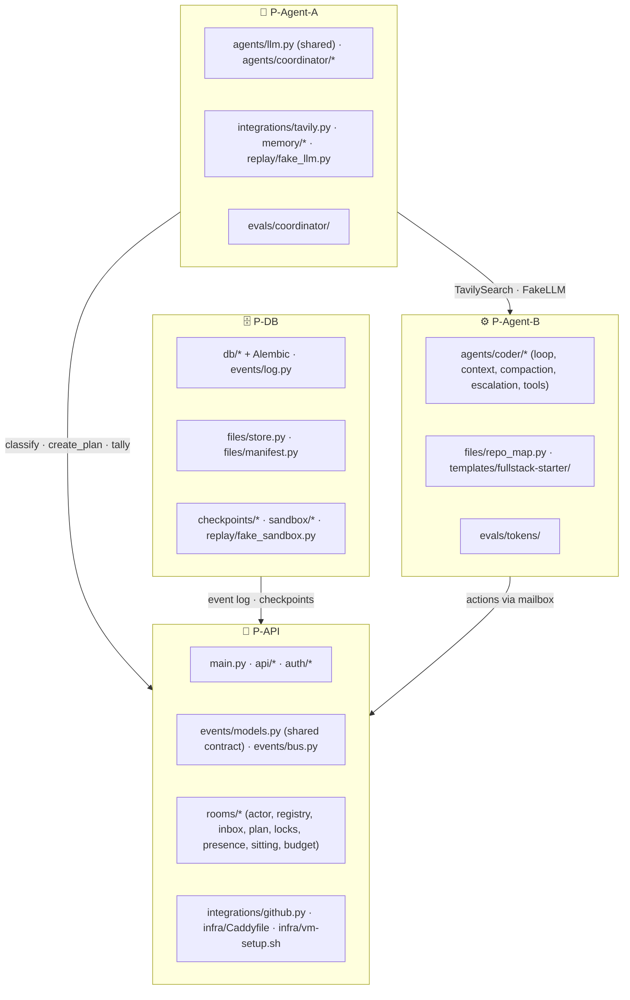

# 🤝 08 · Contributing

**← Prev** [07 · Status & roadmap](07-status-and-roadmap.md) · [📚 Docs home](README.md)

---

## 🧑‍🤝‍🧑 Who owns what



## 🌿 Workflow

1. **Branch** off `main`: `feat/<thing>`, `fix/<thing>` or `docs/<thing>`.
2. **Keep the contract**: anything that changes an event shape goes through `events/models.py` first, then `npm run gen:types`.
3. **Run the checks** (below) before pushing.
4. **Open a PR** into `main` with what changed, why, and how you tested it.

## ✅ Pre-push checklist

```bash
# web
cd mux/web && npx tsc --noEmit && npm run lint && npm run build

# server
cd mux/server && pytest -q && pyright mux tests scripts
```

## ✍️ Conventions

| Area | Convention |
|---|---|
| Docs and comments | Plain, short sentences; say *why*, not *what* |
| Frontend state | Only the reducer turns events into state; components render it |
| Frontend styling | Room UI uses the CSS variables in `globals.css`; marketing pages use Tailwind theme tokens |
| Backend state | Only the room actor changes room state; agents send actions to its mailbox |
| Agents | No shell, no secrets in prompts, fixed toolset |
| Tests | Use `FakeLLM` / fake sandbox; no real API keys in CI |
| Decisions | Big ones get a dated entry in `session-log/` |

## 🧭 Design decisions log

Every architecture choice (Q1–Q39) and its reasoning is in [`session-log/`](../session-log/):

| Date | Session |
|---|---|
| 2026-09-27 | [Ideation grill](../session-log/2026-09-27-ideation-grill.md) |
| 2026-09-28 | [Architecture grill](../session-log/2026-09-28-architecture-grill.md) |
| 2026-09-30 | [Backend plan & Agent-A](../session-log/2026-09-30-backend-plan-and-agent-a.md) |
| 2026-10-01 | [Coordinator & memory](../session-log/2026-10-01-agent-a-coordinator-and-memory.md) |

---

<div align="center">

**Eight people steering. One agent building. Let's ship it. 🚀**

[📚 Back to the docs home](README.md)

</div>
