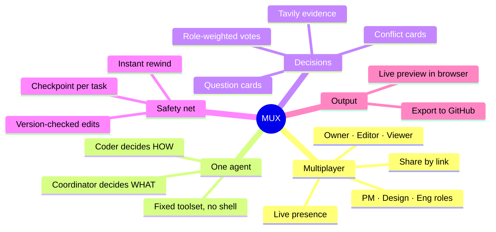

<div align="center">

# 📚 The MUX docs

```
   ┌─────────┐
 1 ┤         │
 2 ┤         │
 3 ┤         │
 4 ┤   MUX   ├──▶  one agent, building
 5 ┤   8:1   │
 6 ┤         │
 7 ┤         │
 8 ┤         │
   └─────────┘
```

**Everything you need to understand, run and build MUX.**

[← Back to the project README](../README.md)

</div>

---

## 🗺️ Pick your path

| If you want to… | Read | Time |
|---|---|---|
| 🤔 Understand what MUX is and why it exists | [01 · Overview](01-overview.md) | 5 min |
| 🏗️ See how the pieces fit together | [02 · Architecture](02-architecture.md) | 15 min |
| 🚀 Run it on your machine | [03 · Getting started](03-getting-started.md) | 5 min |
| 🖥️ Work on the web app | [04 · Frontend](04-frontend.md) | 10 min |
| 🐍 Work on the server and agents | [05 · Backend](05-backend.md) | 10 min |
| 📡 Know every event on the wire | [06 · Event catalog](06-event-catalog.md) | reference |
| 🚦 See what's done and what's next | [07 · Status & roadmap](07-status-and-roadmap.md) | 5 min |
| 🤝 Start contributing | [08 · Contributing](08-contributing.md) | 5 min |

## 🧭 The 30-second version



## 📖 Source documents

These docs summarise and link to the original design contract. When they disagree, the source wins.

| Document | What's in it |
|---|---|
| [`source-of-truth/prd.md`](../source-of-truth/prd.md) | Product requirements: problem, users, scope, judging, schedule |
| [`source-of-truth/architecture.md`](../source-of-truth/architecture.md) | The technical design, section by section |
| [`session-log/`](../session-log/) | Every design decision (Q1–Q39) and how we got there |
| [`demos/`](../demos/) | Static HTML mockups of the room and the workflow |
| [`source-of-truth/design-theme.md`](../source-of-truth/design-theme.md) | GitHub Dark theme tokens used by the web app |

## 🔤 Glossary

<details>
<summary><b>Click to expand</b></summary>

| Term | Meaning |
|---|---|
| **Room** | One shared project: its people, plan, files, history and agent |
| **Room actor** | The single in-memory process that applies every change to a room, in order |
| **Coordinator** | The fast model that reads every message and decides *what* gets built |
| **Coder** | The strong model that writes the code for the current task |
| **Turn boundary** | After each coder LLM turn: merges and interrupts are applied here |
| **Task boundary** | After `finish_task`: checkpoint saved, vote results applied, next task picked |
| **Conflict card** | A vote opened when two instructions contradict each other |
| **Question card** | A decision the coder asks the room for, with a default after 5 minutes |
| **Checkpoint** | Snapshot after each task: file manifest, sandbox snapshot, plan, task log |
| **Domain role** | PM, Design or Eng: gives a 2× vote in that domain |
| **Sitting** | One working session; ends after 30 idle minutes or "End session" |
| **Demo mode** | The web app running fully in the browser with sample rooms, no backend |

</details>
