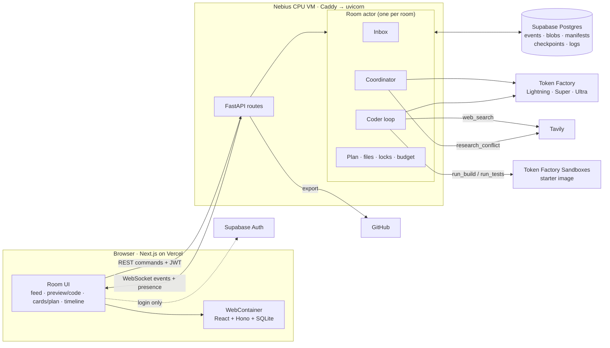

# MUX architecture

| | |
|---|---|
| **Status** | v1.1, 2026-10-02. Adds team notes (§6.1, proposed) and the open decisions Q40–Q55 (§22) |
| **Based on** | [`prd.md`](prd.md) v2 and decisions Q1–Q39 in [`../session-log/2026-09-28-architecture-grill.md`](../session-log/2026-09-28-architecture-grill.md) |
| **Code** | [`../mux/`](../mux/). Every module named here has a stub file there. |
| **UI reference** | [`../demos/mux-room-demo.html`](../demos/mux-room-demo.html), theme in [`design-theme.md`](design-theme.md) |

Values marked **(default)** are starting points picked for this document, not decisions from the grill sessions. Change them freely. Items marked **(spike)** depend on the week-1 risk spikes due Oct 1.

---

## 1. Principles

1. **One writer per room.** Each room has one room actor that applies every change in order, and one coder that writes code. The multiplayer part is many inputs funnelled into that one ordered stream.
2. **Events are the truth.** Every change is an event in Postgres. The UI, the timeline, rewind, and crash recovery are all built from the event log.
3. **The backend owns the files.** Sandboxes and the browser borrow copies. That makes rewind instant and independent of sandbox speed.
4. **AI never holds secrets or shells.** The coder has a fixed toolset and no shell. No model ever sees a GitHub token.
5. **Spend tokens only where they buy quality.** Fresh context per task, trimmed tool output, and the cheapest model that can do each job.

## 2. System overview



| Layer | Tech | Code |
|---|---|---|
| Frontend | Next.js (App Router), TypeScript, Monaco or CodeMirror, WebContainer API | `mux/web/` |
| API | FastAPI, uvicorn, behind Caddy (TLS + WebSocket upgrade) | `mux/server/mux/api/` |
| Room runtime | asyncio room actors | `mux/server/mux/rooms/` |
| Agents | OpenAI Python client pointed at Token Factory | `mux/server/mux/agents/` |
| Storage | Supabase Postgres (async SQLAlchemy + asyncpg) | `mux/server/mux/db/` |
| Builds | Token Factory Sandboxes Python SDK | `mux/server/mux/sandbox/` |
| Shared types | Pydantic → JSON Schema → TypeScript | `mux/server/mux/events/models.py`, `mux/packages/schema/` |

## 3. Room actor

`rooms/actor.py`. One asyncio task per active room, kept in `rooms/registry.py`.

**State it owns (in memory, rebuilt from events):**
- Room settings, members, and roles.
- The plan: `[{id, title, status, owner_role?, notes?}]`, where status is `draft | todo | doing | done | skipped_conflict | skipped_question`.
- The inbox of messages waiting for the coder.
- The current file manifest (path → blob hash) and version counter per file.
- Soft locks for manual editing.
- Open conflicts and questions, with timers.
- Budget counters.
- The head checkpoint and the current log.

**How it works:**
- Every command (from REST) and every agent action goes into the actor's mailbox, an `asyncio.Queue`. The actor handles one item at a time: it validates the item, appends the resulting events to Postgres, updates memory, then publishes the events to the room's sockets (`events/bus.py`).
- The coordinator and the coder run as child tasks of the actor. They never change state directly. They send actions to the mailbox, like any user.
- **Crash recovery:** on first access after a restart, `registry.py` replays the room's events from the latest checkpoint forward to rebuild the state.
- **Idle rooms:** an actor with no connections and no running coder shuts down after 10 minutes **(default)** and is rebuilt on next access.

**Two pause points for the coder (Q4):**
- **Turn boundary**, after each LLM turn and its tool calls: the actor hands over merged messages and manual-edit notes, and applies interrupts.
- **Task boundary**, after `finish_task`: the actor saves a checkpoint and writes the task log, applies closed vote results and answers, and picks the next task.

## 4. Transport

### 4.1 REST commands

Every command carries the Supabase JWT (`auth/supabase.py`), is checked by `auth/permissions.py`, and returns `{accepted: true, seq}` once its event is written.

| Method and path | Who | What |
|---|---|---|
| `POST /rooms` | signed-in user | Create a room from a description |
| `GET /rooms`, `GET /rooms/{id}` | members | List rooms, fetch one |
| `PATCH /rooms/{id}/sharing` | owner | Link access, invites, member roles |
| `POST /rooms/{id}/messages` | editor, owner | Send a steering message |
| `PATCH /rooms/{id}/plan` | editor, owner | Edit the draft plan (before approval) |
| `POST /rooms/{id}/plan/approve` | owner | Approve the plan |
| `POST /rooms/{id}/conflicts/{cid}/vote` | editor, owner | Vote |
| `POST /rooms/{id}/conflicts/{cid}/override` | owner | Override a vote |
| `POST /rooms/{id}/questions/{qid}/answer` | editor, owner | Answer an `ask_room` question |
| `POST /rooms/{id}/files/lock` / `unlock` | editor, owner | Take or release the soft lock on a file |
| `PUT /rooms/{id}/files` | lock holder | Save a manual edit: `{path, base_version, content}` |
| `POST /rooms/{id}/rewind` | editor, owner | Rewind to a checkpoint |
| `POST /rooms/{id}/end-session` | owner | End the sitting and write the day log |
| `PATCH /rooms/{id}/budget` | owner | Raise the budget cap |
| `GET /github/connect`, `POST /rooms/{id}/export` | owner | Connect GitHub, export |

Rate limit: 1 message per user every 5 seconds, enforced in the actor.

### 4.2 WebSocket

`GET /rooms/{id}/ws?since={seq}` (`api/ws.py`).
- On connect, the server sends every event after `since`, then streams new events live. A reconnecting client passes its last seq and loses nothing.
- **Event envelope:** `{seq, room_id, type, actor, ts, payload}`.
- **Presence messages** (`presence.join`, `presence.leave`, `presence.typing`, `presence.tab`) use the same socket but are never stored.
- **Streaming coder text** goes out as `agent.text.delta` messages that are not stored. The complete text is stored once as `agent.text` at the end of the turn, which keeps the event log small.

### 4.3 Event catalog

Defined as Pydantic models in `events/models.py`, exported to `packages/schema/`.

| Group | Types |
|---|---|
| Room | `room.created`, `member.joined`, `member.role_changed`, `sharing.changed` |
| Messages | `message.posted` (with `to`: `agent` or `team`, see §6.1), `message.labeled` (merge, queue, interrupt, conflict, chat; never for team notes) |
| Plan | `plan.drafted`, `plan.edited`, `plan.approved`, `plan.item_added`, `plan.item_updated` |
| Coordinator | `coordinator.reply`, `conflict.opened`, `conflict.evidence`, `conflict.vote`, `conflict.closed`, `question.opened`, `question.answered`, `question.defaulted` |
| Coder | `task.started`, `agent.text`, `tool.called`, `tool.result` (summary only), `build.result`, `test.result`, `task.escalated`, `task.finished`, `turn.interrupted` |
| Files | `file.changed` (by coder or human, with version and diff summary), `file.locked`, `file.unlocked` |
| Checkpoints | `checkpoint.created`, `room.rewound` |
| Memory | `log.task_written`, `log.day_written` |
| Budget | `budget.updated`, `room.paused`, `room.resumed` |
| Export | `export.started`, `export.finished` |

## 5. Data model

Postgres tables (`db/tables.py`). Supabase owns `auth.users`.

| Table | Key columns |
|---|---|
| `rooms` | id, owner_id, title, description, link_access, link_permission, budget_tokens_cap, budget_runs_cap, head_checkpoint_id, created_at |
| `memberships` | room_id, user_id, permission (owner, editor, viewer), domain_role (pm, design, eng) |
| `events` | room_id, seq, type, actor_id, payload jsonb, active (false after a rewind greys it out), created_at. Primary key (room_id, seq). |
| `blobs` | hash (sha256), content bytea, size. Shared across rooms, so identical files are stored once. |
| `manifests` | id, room_id, entries jsonb (path → {hash, version}) |
| `checkpoints` | id, room_id, seq, manifest_id, sandbox_snapshot_uuid, plan jsonb, task_log_id, parent_id, created_at |
| `logs` | id, room_id, kind (task, day), body text, pins jsonb, checkpoint_id |
| `conflicts` | id, room_id, task_id, options jsonb, evidence jsonb, domain, status, result, resolved_by |
| `votes` | conflict_id, user_id, option, weight |
| `questions` | id, room_id, task_id, text, options jsonb, default_option, answer, status, expires_at |
| `budgets` | room_id, tokens_used, runs_used, updated_at |
| `github_tokens` | user_id, token_encrypted, scopes, created_at |

The event log is append-only. The plan, conflicts, questions, and budget tables are projections kept for fast reads. They can always be rebuilt from events.

## 6. Coordinator

Code: `agents/coordinator/`. It decides **what** gets built. It sees the plan, the pending messages, open cards, member roles, and the latest log. It never sees file contents.

**Model:** Nemotron 3.5 Lightning with `response_format: json_schema`. If Lightning's JSON proves unreliable in the spike, Super takes over **(spike)**. `create_plan` always runs on Super.

**One message at a time per room (Q6):** the actor feeds messages to the coordinator in order, so each call sees every earlier message still pending. That is how it spots conflicts.

**Output: one action per message** (`agents/coordinator/schema.py`). These are fields of the JSON output rather than real tool calls, which is faster and more reliable on a small model. The actor validates each action before applying it.

```json
{
  "label": "merge | queue | interrupt | conflict | chat",
  "rationale": "one sentence",
  "domain": "ui | architecture | scope | null",
  "add_plan_item": {"title": "...", "after_task_id": "t4"},
  "open_conflict": {"with_message_ids": ["m12"], "summary": "...", "options": ["...", "..."], "research_queries": ["..."]},
  "reply": "text for chat messages"
}
```

| Action | When | What the actor does |
|---|---|---|
| `classify` | Every message | Writes `message.labeled` |
| `create_plan` | New room | Super drafts tasks, then `plan.drafted` |
| `add_plan_item` | Label is queue | Inserts the item at the chosen position |
| `open_conflict` | Label is conflict | Opens the card, marks the task `skipped_conflict` |
| `research_conflict` | After `open_conflict` | Runs 1–3 Tavily queries and writes a cited summary as `conflict.evidence` |
| `reply` | Label is chat | Writes `coordinator.reply` |

**Votes (Q19):**
- Editors and the owner vote. The vote closes when all have voted, or after 60 seconds, or when the owner overrides.
- Weights **(default)**: every voter counts 1. A voter whose domain role matches the conflict's domain (Design for UI, Eng for architecture, PM for scope) counts 2. A tie goes to the owner's choice, or to the option backed by the domain-role voter if the owner didn't vote.
- The result is pinned in the log and applied at the next task boundary.

### 6.1 Team notes (proposed by P-Agent-A, 2026-10-02, needs team agreement)

People in a room also need to talk to each other (the web app already sends @mention notifications). Without a separate path, a message like "@Dan login or not?" goes to the coordinator, which answers for Dan or treats a half-formed idea as an instruction.

- The composer has an **Agent / Team** toggle, default Agent. It flips to Team when the text starts with `@someone`, and the person can flip it back. The server trusts the field.
- `POST /rooms/{id}/messages` takes an optional `to: "agent" | "team"` (default `"agent"`). Owner and editors only. Rate limit: 1 per 5 seconds for agent messages, 1 per second for notes.
- `message.posted` carries `to`. A team note is stored and published, but it never enters the inbox, is never classified, and never gets `message.labeled`.
- The coordinator sees the last 5 notes as context only, without ids (`RoomView.team_notes`), so a note can never be part of a conflict. This part is built and tested.
- Notes are room-level events: a rewind does not grey them out (see Q41 in §22).
- Notes stay out of the task and day logs.
- No "Send to agent" button on notes for now (maybe week 4).

## 7. Coder

Code: `agents/coder/`. It decides **how** to build the current task.

### 7.1 The loop

`agents/coder/loop.py`, hand-rolled (Q11):

```text
for task in plan (next todo task):
    ctx = build_context(task)                  # context.py
    model = "super"
    while turns < MAX_TURNS:                   # default 25
        reply = llm(model, ctx, tools)         # streams agent.text.delta
        results = run_tools(reply.tool_calls)
        ctx = compact(ctx, results)            # compaction.py
        boundary = actor.turn_boundary()       # merges, edit notes, interrupt
        if boundary.interrupt: break and re-plan the task
        ctx += boundary.merges + boundary.edit_notes
        if two_failed_builds_in_a_row: model = "ultra"      # escalation.py
        if same_error_seen_twice_on_ultra: ask_room or skip
        if task finished: break
    actor.task_boundary(task)                  # checkpoint + task log
```

### 7.2 Fresh context per task

`agents/coder/context.py` builds the context in this order. The unchanging parts come first so a prompt cache can reuse them **(spike)**.
1. System prompt, tool definitions, and the template's `CONVENTIONS.md` (stable).
2. The latest room log, with pins (changes per task).
3. The plan, with the current task highlighted.
4. The repo map from `files/repo_map.py`.
5. The files most relevant to the task: files named in the task, plus files changed in the last task, capped at 3 files or 400 lines **(default)**.
6. Merged messages and manual-edit notes for this task.

### 7.3 Tools

`agents/coder/tools/`. One file per group.

| Tool | Arguments | Returns |
|---|---|---|
| `read_file` | path, start_line?, end_line? | Content and version stamp |
| `write_file` | path, content | New version. Only for files that don't exist yet; fails if the file exists |
| `edit_file` | path, base_version, edits: [{find, replace}] | New version, or `stale: re-read first` if base_version is old, or `no match` |
| `list_files` | none | Repo map: each path with its exports, React components, and Hono routes |
| `delete_file` | path, base_version | OK or stale |
| `run_build` | none | pass or fail, duration, at most 5 deduplicated errors as `file:line: message` |
| `run_tests` | pattern? | pass or fail, counts, at most 5 failures |
| `web_search` | query | Tavily's short answer plus 2–3 snippets with URLs, cached per room |
| `ask_room` | question, options, default | Question id. The task is skipped until it's answered or 5 minutes pass |
| `update_plan` | status or split: [titles] | OK. Only applies to the current task |
| `finish_task` | summary | Ends the task and triggers the checkpoint |

Nothing else is available: no shell, no package install, no git, no network except `web_search`.

### 7.4 Escalation and limits (`escalation.py`)
- 2 consecutive failed builds on a task switch that task to Ultra (Q13).
- `MAX_TURNS` per task: 25 **(default)**. When it's reached, the coder calls `ask_room` or marks the task skipped with a note.
- Loop detection: the same tool call with the same arguments 3 times in a row, or the same build error twice on Ultra, stops the loop. Only back-to-back repeats count, so build, edit, build is progress. Build errors from before the switch to Ultra do not count against Ultra.
- Reasoning mode is off for simple edits and on for planning and error fixing, if Token Factory exposes a switch **(spike)**.

## 8. Token efficiency

Target (Q38): at least 40% fewer tokens per finished task than a naive loop on the same models, with the same or better build success.

| Technique | Where |
|---|---|
| Fresh context per task, rolling log of at most one page | `context.py`, `memory/` |
| Tool results already used shrink to one-line stubs after each turn | `compaction.py` |
| Line-range reads, compact repo map | `tools/files.py`, `files/repo_map.py` |
| Search-and-replace edits instead of whole files | `tools/files.py` |
| Build and test output trimmed to 5 deduplicated errors | `sandbox/errors.py` |
| Short Tavily results, cached per room | `integrations/tavily.py` |
| Starter template and a short conventions sheet, so no boilerplate is generated | `templates/fullstack-starter/` |
| Cheapest model per job: Lightning, Super, Ultra only on escalation | `agents/llm.py` |
| Reasoning off for simple edits **(spike)** | `agents/llm.py` |
| Stable prompt prefix for caching **(spike)** | `prompts.py`, `context.py` |
| Turn limits and loop detection | `escalation.py` |
| The coordinator never reads files | `agents/coordinator/prompts.py` |
| Streaming deltas are not stored as events | `api/ws.py` |

**Measuring it:** `evals/tokens/naive_agent.py` is a baseline with the same models and tools, but full history, whole-file reads, whole-file writes, and full build logs. `evals/tokens/compare.py` runs both on the 20 build prompts and reports tokens per finished task, tokens per app, and build success. Token counts come from the API's `usage` fields. If time allows, Aider or OpenHands runs on the same prompts as a second baseline.

## 9. Files, versions, and manual editing

- **Store** (`files/store.py`): content-addressed. Each file's bytes are stored once under their sha256 hash.
- **Manifest** (`files/manifest.py`): maps each path to `{hash, version}`. Each file's version goes up by one on every change, whoever makes it.
- **Coder edits:** `edit_file` and `delete_file` carry the `base_version` the coder last read. If it doesn't match, the tool returns `stale: re-read first`, and nothing changes.
- **Manual edits (Q37):**
  1. An editor opens a file for editing, and `POST /files/lock` takes the soft lock. Others see "Dan is editing" and a read-only view.
  2. Saving sends `PUT /files` with the base version. The actor checks the lock and version, stores the new blob, bumps the version, and emits `file.changed` with a diff summary.
  3. At its next turn boundary, the coder gets a note: "Dan edited `Hero.tsx` (v4 → v5)" plus a short diff.
  4. The lock is released on unlock, on disconnect, or after 2 minutes idle **(default)**.
  5. A person can edit a file the coder is working on. Version checks keep either side from overwriting the other.
- Manual edits go into the next checkpoint. The timeline shows each save as a small marker.

## 10. Checkpoints and rewind

**Checkpoint** (`checkpoints/checkpoint.py`), written at every task boundary:
- The file manifest id.
- The sandbox snapshot UUID from the last successful `run_build` (shown as "built on Nebius").
- The plan at that moment.
- The task log written for that task (Q33).
- Its parent checkpoint.

**Rewind** (`checkpoints/rewind.py`, Q21):
1. The actor tells the coder to stop. It stops at its next turn boundary.
2. The head moves to the chosen checkpoint: its manifest, plan, and log become current. No sandbox call is needed, so it is instant.
3. Events after that checkpoint are marked `active = false` (greyed out, not deleted). Rewinding forward flips them back.
4. Messages still waiting in the inbox are re-classified against the restored plan.
5. The browser gets `room.rewound`, reloads files into the WebContainer, and redraws.

## 11. Memory

Code: `memory/`.
- **Task log** (`task_log.py`): written by Lightning after every task. It holds what the app is, what changed, open threads, conventions, and pinned facts. It is capped at about 600 tokens **(default, "about one page")**. Each new log rolls forward what still matters from the previous one (Q31).
- **Pins** (`pins.py`): vote results and owner overrides. These are always copied forward and never summarized away.
- **Day log** (`day_log.py`): when a sitting ends (everyone gone for 30 minutes, or End session), the task logs are compacted into one summary of the current state. The next sitting reads only the day log. It also rolls from day to day.
- Every log is stored with its checkpoint, so a rewind restores the log from that moment and the agent does not remember undone work.

## 12. Sandbox builds and tests

Code: `sandbox/`.
- **Starter image** (`infra/sandbox-image/`): Node, the full-stack template, and every approved package preinstalled. The coder cannot install anything (Q14).
- **A run** (`sandbox/runner.py`): upload the current manifest's files onto the starter image, then run `typecheck && build` (for `run_build`) or the test command (for `run_tests`). A successful build is run with `disposable=False`, so its result becomes an image UUID saved as the checkpoint snapshot.
- **Known limits** (from research): each run boots a fresh microVM in about 2–5 s, the default timeout is 30 s, output is truncated at 8 KB, and there are at most 50 concurrent operations. Whether `npm install` has network access is unconfirmed, which is why packages are baked in.
- **Output** (`sandbox/errors.py`): parses TypeScript, Vite, and test-runner output into at most 5 deduplicated `file:line: message` lines.

## 13. Preview

Code: `web/src/lib/webcontainer.ts`, `web/src/components/center/Preview.tsx`.
- The browser boots a WebContainer, mounts the current files, and starts the Vite frontend and the Hono backend. The preview iframe shows the running app, and the frontend calls the backend inside the same WebContainer.
- SQLite uses a build that runs in the browser **(spike)**.
- On `file.changed`, only the changed files are written into the WebContainer, and Vite's hot reload updates the preview.
- WebContainers need cross-origin isolation, so `web/next.config.ts` sends COOP and COEP headers on every page.
- **Fallback (spike):** if WebContainers can't run the template, the preview switches to a port exposed from a Nebius sandbox if that is supported, or to a per-room container on the VM.

## 14. Budget

`rooms/budget.py`. It counts tokens from every LLM response's `usage` field, plus sandbox runs. The default cap is about 2M tokens per room. At the cap, the actor emits `room.paused`, and the coder stops at its next turn boundary until the owner raises the cap. The meter in the top bar shows tokens and builds used.

## 15. Security and permissions

- The browser uses Supabase for login only. All data goes through the backend. Rules live in `auth/permissions.py`.
- Owner only: export, delete, sharing, budget, plan approval, vote override. Owner and editors: steer, vote, answer questions, edit files, rewind. Viewers: read only.
- The coordinator treats messages as requests for the agent, never as permission changes.
- The GitHub token is requested only at export (repo scope), encrypted with a server key (`cryptography`), and used only by `integrations/github.py`. No model can see it.
- Generated code runs only in Nebius sandboxes and in the viewer's own browser, never on the MUX VM.

## 16. GitHub export

`api/export.py` and `integrations/github.py`.
1. The owner clicks Export. If no token is stored, MUX runs the Connect GitHub OAuth flow with repo scope.
2. The backend reads the head checkpoint's manifest and creates a new repository, or opens a PR against an existing one, with one commit per export **(default)**.
3. It emits `export.finished` with the link.

## 17. Frontend

Code: `mux/web/`.
- **State:** `lib/reducer.ts` is a pure function from events to room state. Components only render that state. This makes replay and rewind free on the client.
- **Data flow:** commands go out through `lib/api.ts` (REST); events come in through `lib/socket.ts` (resumable WebSocket). There is no optimistic state beyond "sending…" on the composer.
- **Layout:** top bar (`components/room/`), feed (`components/feed/`), preview and code (`components/center/`), cards and plan (`components/side/`), timeline (`components/timeline/`). It matches the reference mockup.
- **Theme:** GitHub Dark tokens in `styles/theme.css`, from [`design-theme.md`](design-theme.md).

## 18. Deployment

| Piece | Where |
|---|---|
| Frontend | Vercel |
| Backend | One Nebius CPU VM: uvicorn as a systemd service, Caddy in front for TLS and WebSocket upgrades (`infra/Caddyfile`, `infra/vm-setup.sh`) |
| Database and auth | Supabase |
| Models and sandboxes | Nebius Token Factory |
| Search | Tavily |

One backend process is enough for the hackathon, because room actors live in memory in that process. Scaling out later would need rooms pinned to processes, and that is out of scope.

## 19. Development and testing

- **Replay mode** (`server/mux/replay/`): a fake LLM and a fake sandbox replay recorded outputs, so P1 can build the whole UI before the agent works, and tests run without API keys.
- **Tests** (`server/tests/`): room actor ordering, coordinator actions, coder loop with fake tools, tool version checks, rewind.
- **Evals** (`mux/evals/`): coordinator label accuracy (≥ 85% on 50 scenarios), build and test success (≥ 80% on 20 prompts), and tokens against the naive baseline (≥ 40% fewer).
- **Schema sync:** `server/scripts/export_schema.py` writes JSON Schema to `packages/schema/generated/`, and `web` generates TypeScript types from it in CI.

## 20. Week-1 spikes (due Oct 1)

| Spike | Owner | Pass condition | Fallback |
|---|---|---|---|
| WebContainers run the full-stack template (Vite + Hono + SQLite) | P1 | Boots and hot-reloads in under 15 s **(default)** | Sandbox port, or per-room container |
| Nebius sandbox can expose a port | P3 | A running Hono server is reachable | Keep WebContainers |
| Sandbox build time from the starter image, and network for install | P3 | Type-check + build under 30 s | Smaller template, longer timeout |
| Lightning JSON reliability | P2 | ≥ 95% valid JSON on 50 calls | Super as coordinator |
| Super tool calling | P2 | Correct tool calls on 20 scripted tasks | JSON-in-text tool calls |
| Prompt caching and reasoning switch on Token Factory | P2 | Documented or observed | Skip those two techniques |
| WebSockets through Caddy on the VM | P3 | Stable for 30 minutes with reconnect | Server-sent events |

## 21. Deferred

- **Demo room** (Q22, Q32): decided in week 4.
- **Stretch:** forking, research mode, real-time co-editing of one file (CRDT).

## 22. Open decisions (Q40–Q55), 2026-10-02

Found while building P-Agent-A's code and reviewing P-Agent-B's coder. Each has a suggested answer. Owners reply "ok" or object; agreed answers then move into the sections above.

### A. Rewind and saving

| # | Decision | In plain words | Suggestion | Owner |
|---|---|---|---|---|
| Q40 | How rewind marks undone events | §10 flips `events.active` to false, which edits old records. An event log should never change, and flipping gets confusing after two rewinds | Keep events immutable. Emit `room.rewound{checkpoint_id}` and compute the active set from the checkpoint tree | P-DB |
| Q41 | What rewind undoes | Rewinding to 2 pm should not remove a teammate who joined at 3 pm or refund spent budget | Split events into **timeline** events (files, plan, messages, cards, logs), which rewind greys out, and **room-level** events (membership, sharing, budget, export, team notes), which rewind never touches | P-DB, P-API |
| Q42 | Crash recovery | §3 rebuilds from the latest checkpoint, but a checkpoint does not hold members, open cards, locks, or budget | Replay every event from seq 0. Rooms have a few thousand events at most | P-API, P-DB |

### B. Technical setup

| # | Decision | In plain words | Suggestion | Owner |
|---|---|---|---|---|
| Q43 | Database connection | Supabase's transaction pooler breaks asyncpg prepared statements | Use the direct or session connection string, or `statement_cache_size=0` | P-DB |
| Q44 | WebSocket login | Browsers cannot set headers on a WebSocket, and a token in the URL leaks into logs | Send the JWT as the first socket message | P-API |
| Q45 | Two people editing the plan | `PATCH /plan` sends the whole plan, so the second save wipes out the first | Send plan operations (add, remove, move, rename) by item id | P-API |
| Q46 | Long build output | Sandbox output is cut at 8 KB, so the useful error is often lost | Parse errors inside the sandbox and return at most 5 `file:line: message` lines as short JSON | P-DB |
| Q47 | Stuck file locks | A lock could outlive its holder after a restart | Keep locks in memory only and clear them when the actor is rebuilt | P-API |

### C. Coordinator

| # | Decision | In plain words | Suggestion | Owner |
|---|---|---|---|---|
| Q48 | A vote nobody can break | Ties go to the owner, then to the domain-role voter. Two Eng voters splitting a scope vote with no owner vote stays tied. `tally` returns `winner=None, decided_by="tie"` | The task stays `skipped_conflict`, and the owner is asked to override | Everyone |
| Q49 | When the model fails twice | The coordinator queues the message as a plan item, so nothing is lost. The planner drafts a one-task plan the team can fix. Both return `fallback=True` | Keep both | Everyone |
| Q50 | Team notes | Person-to-person messages in the same feed (§6.1). Touches P-API's files (`events/models.py`, `api/commands.py`, `rooms/actor.py`) and the frontend | Agree to §6.1. P-Agent-A builds the Python parts, the frontend owner builds the UI | Everyone, P-API |

### D. Coder

| # | Decision | In plain words | Suggestion | Owner |
|---|---|---|---|---|
| Q51 | Where builds run | `agents/coder/tools/build.py` runs `npm` on the machine that calls it. On the backend server, that runs AI-written code on the server | Builds run only in the Nebius sandbox through `sandbox/runner.py`. The local runner is for development on a laptop | P-DB, P-Agent-B |
| Q52 | How the coder saves files | `agents/coder/tools/files.py` writes straight to disk, so no `file.changed` event is emitted, and rewind, checkpoints, the code view, and locks never see the change. The coder's versions are content hashes, while `PUT /files` uses a version number | Coder file tools go through the actor (`actor.ask`, answered with a new version or `stale`) and the store and manifest (§9). Use one version style everywhere: the manifest's version number | P-API, P-DB, P-Agent-B |
| Q53 | Who builds the starter template | `templates/fullstack-starter/` is still one-line stubs; only `CONVENTIONS.md` is written. Nothing can be built or demoed without it | P-Agent-B owns it, done early in week 2 | P-Agent-B |
| Q54 | The naive baseline for the token target | §8 promises at least 40% fewer tokens than a naive agent, but the naive agent is not defined; `evals/tokens/naive_agent.py` only records numbers | Naive means the same tasks with the full history, whole files, and no compaction. Run both on the same 20 prompts | P-Agent-B |
| Q55 | What `list_files` returns | §7.3 says the repo map; the code returns the file paths under a directory, and the repo map goes into the context (§7.2) | Keep the code: paths from `list_files`, repo map in the context | P-Agent-B |

### Answered by the weekend spikes, not by the team

- Lightning or Super for the coordinator (Lightning JSON spike, §20).
- Whether the reasoning switch exists, and whether reasoning stays on for the coder. The coder loop now defaults to `reasoning=None` (not sent) until then.

